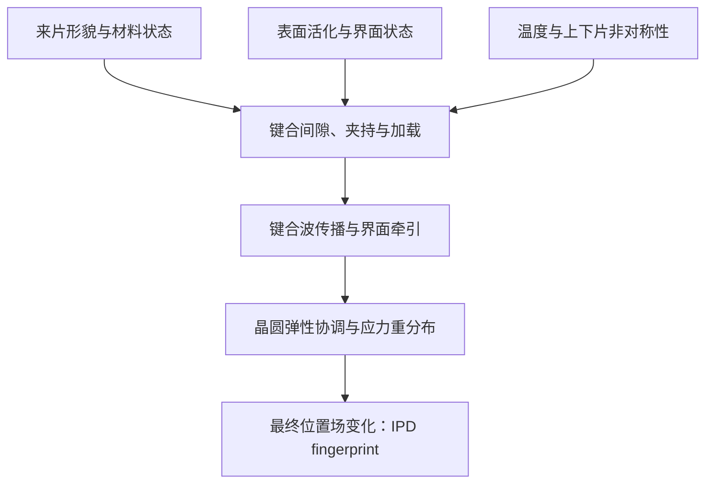
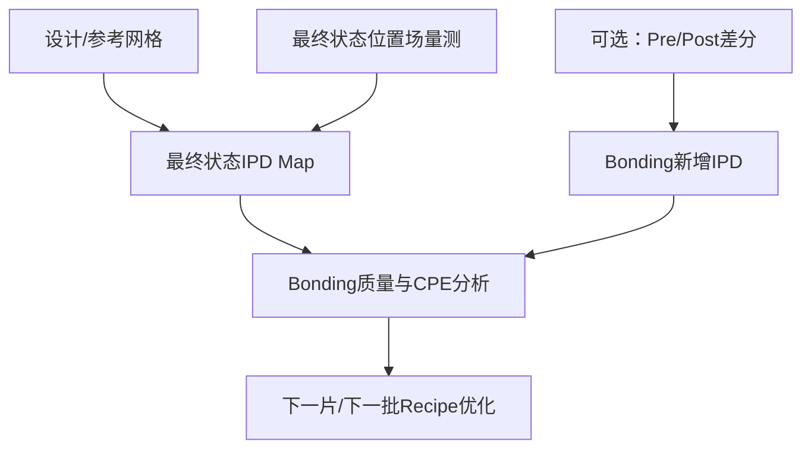
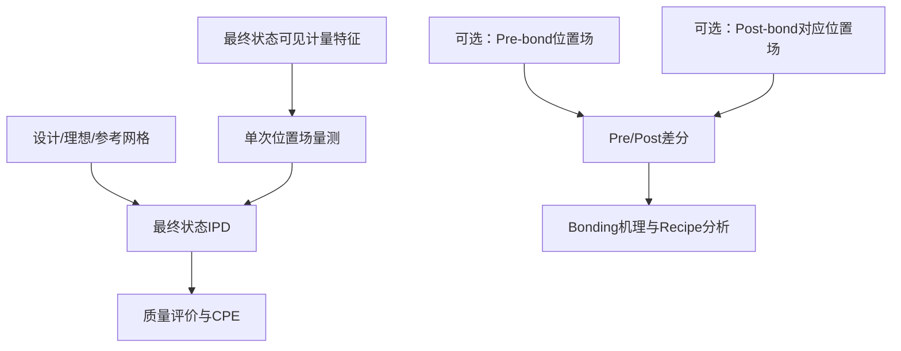

# 1 nm IPD量测设备项目书——第一章与第二章

> 文档状态：重写稿  
> 编写依据：Git仓库当前技术基线、IPD与Bonding应用基线及公开论文/专利  
> 本稿口径：最终状态单次量测为生产主模式，以最终实测位置场相对设计网格或参考网格的偏差获得IPD；同一组特征的Pre/Post差分作为可选的机理分析模式，不再把正反面坐标转移设为主路线。
>
> 指标口径：项目名称中的“1 nm”指设备对有效图案或计量标记X、Y位置的量测能力，以及由该位置相对规定参考形成IPD的能力；不指CPE拟合残差、曝光后Overlay、Bonding Overlay、运动平台定位精度或单项jitter达到1 nm。

# 第一章 项目背景与应用需求

## 1.1 先进集成工艺正在把Overlay问题由“层间对准”扩展到“晶圆形变控制”

传统光刻中的Overlay，主要描述当前曝光层相对于前一层图形的位置偏差。随着器件尺寸缩小，Overlay控制已不再只是对准系统能否识别标记的问题，还取决于晶圆在沉积、退火、键合、减薄和夹持等工艺后是否发生了空间非均匀变形。晶圆若仅发生整体平移、旋转或均匀缩放，可通过常规低阶模型进行补偿；若出现局部拉伸、环状畸变、鞍形畸变或Die内高阶变形，则需要更高密度的位置场量测，才能区分并补偿不同空间尺度的误差。

先进逻辑、背面供电网络（Backside Power Delivery Network，BSPDN）和三维集成工艺进一步放大了这一问题。以BSPDN为例，器件晶圆完成正面器件和埋入式电源轨后，需要将正面与载片进行Fusion Bonding，再从晶圆背面减薄并加工nano-TSV及背面金属层。背面图形最终需要对准正面的器件或埋入式电源轨，其对准误差同时受到键合、减薄、背面加工和光刻机补偿能力的影响。imec公开流程指出，Fusion Bonding本身会使有源晶圆产生畸变，并直接增加后续背面nTSV光刻的对准难度；对于标准单元尺度的结构，相关Overlay要求已进入10 nm以下量级[1]。

因此，工艺控制对象已由单一曝光层的Overlay，扩展为晶圆在关键工艺前后的二维位置场变化。In-Plane Distortion（IPD）正是描述这一变化的核心量。

## 1.2 Fusion Bonding会把工艺状态写入晶圆的位置场

Fusion Bonding并不是两个理想平面的刚性贴合。键合开始时，两片晶圆之间存在微小间隙和气膜；局部接触建立后，键合波由起始区域向外传播。晶圆初始形貌、上下片刚度差异、夹盘平面度、初始间隙、中心加载力、真空释放时序、表面状态、温度分布及键合波速度都会改变瞬态受力和最终残余应力。

Navarro等建立的流固耦合模型表明，晶圆间气膜、薄板弯曲和界面黏附共同决定键合前沿的传播过程[2]。后续研究进一步把夹盘约束、局部释放和中心加载等实际边界条件纳入模型，并通过实验说明释放时序和加载力会改变键合后的局部IPD残差[3]。Jain等在300 mm Fusion Bonding研究中也指出，键合起始方式、键合波速度变化以及上下晶圆不对称是grid distortion的重要来源；通过改变键合方式，可以显著改变后续量得的畸变指纹[4]。

其物理链条可概括为：

由此可见，键合后IPD不是与工艺无关的随机误差，而是晶圆、设备与Recipe共同作用后的空间响应。不同工艺因素可能形成不同的低阶和高阶特征，这为利用IPD评价Bonding过程提供了物理基础。

## 1.3 IPD可作为Bonding几何质量的直接量测量

本项目将Bonding质量分为两类。

第一类是**几何质量**，包括最终晶圆位置场中的全片缩放、正交误差、径向或切向变形、局部高阶畸变、Die内残差及批次重复性。此类质量可由最终状态IPD直接评价。若需要进一步分离Bonding新增的几何变形，可增加Pre-bond量测，并计算Pre/Post差分。

第二类是**界面质量**，包括未键合区、空洞、局部黏附不足和结合强度等。此类缺陷可能同时引起局部应力和IPD异常，但二者不存在一一对应关系。粒子、局部表面状态或不均匀接触可能形成IPD热点，也可能主要表现为空洞而不形成足够大的面内位移。因此，IPD可作为界面质量的关联特征，但需要与扫描声学显微镜、红外成像、界面强度或电学测试结果共同标定后，才能用于概率性识别，不能仅凭一张IPD图唯一判断界面缺陷类型。

这种划分决定了本项目的输出层级：

| 输出层级 | 量测或推测对象 | IPD的作用 | 当前可实现性边界 |
|---|---|---|---|
| 一级：直接量测 | 最终状态二维位置场及其低阶、高阶残差 | 直接输出 | 依赖参考网格定义、可见标记、坐标配准和量测重复性 |
| 二级：几何质量评价 | 全片畸变、局部热点、批次稳定性、Recipe差异 | 直接评价 | 需要建立统一统计指标和控制限 |
| 三级：界面质量推测 | 空洞、局部黏附异常、结合强度风险 | 作为关联特征 | 必须用独立检测真值标定，输出置信度而非确定结论 |
| 四级：工艺控制 | 下一片/下一批Bonding Recipe优化 | 作为反馈数据 | 需要DOE、历史数据库和经验证的预测模型 |

Tokyo Electron公开的集成量测专利已提出相近的工程闭环：将晶圆形貌、Overlay、IPD、应力等量测数据输入Bonding模型，根据预测的post-bond distortion调整温度、压力、间隙和夹持等工艺条件，并利用post-bond数据继续更新后续Recipe[5]。该专利说明“量测—建模—Recipe反馈”具有明确的设备化路径，但不代表仅凭单次IPD量测即可完成全部工艺反演。

## 1.4 Top-wafer IPD能够约束Bonding Overlay，但两者不能直接等同

Bonding Overlay描述上下两片晶圆对应结构在键合界面处的相对位置误差。设顶层、底层晶圆在键合过程中产生的位移场分别为\(\mathbf u_t(x,y)\)和\(\mathbf u_b(x,y)\)，初始对准误差为\(\mathbf O_{align}(x,y)\)，则键合后的相对误差可写成：

\[
\mathbf O_{bond}(x,y)
=\mathbf O_{align}(x,y)
+\mathbf u_t(x,y)-\mathbf u_b(x,y).
\]

若执行同一组计量特征的Pre/Post差分，则差分结果主要对应：

\[
\Delta\mathbf{IPD}_{top}(x,y)\approx\mathbf u_t(x,y).
\]

生产模式下只测最终状态时，获得的是顶层晶圆相对设计或参考网格的\(\mathbf{IPD}_{final}\)，其中还可能包含来片初始grid误差及Bonding前后其他工艺贡献。\(\Delta\mathbf{IPD}_{top}\)比\(\mathbf{IPD}_{final}\)更接近Bonding新增位移，但二者都不能在缺少底层晶圆位移和初始对准信息时直接等同于\(\mathbf O_{bond}\)。项目书中应使用“Bonding Overlay关联、预测或风险评估”，不使用“Top IPD即Bonding Overlay”的表述。

## 1.5 项目的应用主线由单点检测扩展为工艺闭环

现有Bonding质量检测多关注空洞、颗粒和界面缺陷，常规Overlay量测则侧重少量标记或低阶模型。对于Bonding引入的非线性、高阶和局部位置变化，两类方法之间仍存在空缺：界面检测无法给出完整的二维位移场，低密度Overlay量测又可能漏掉局部畸变。

本项目以最终状态位置场量测为主，并保留Pre/Post差分作为可选诊断手段，形成以下应用闭环：

该闭环包含三个相互衔接但不可混同的目标：

1. **测得状态**：以最终位置场相对设计或参考网格的偏差获得可追溯的Top-wafer IPD Map；必要时增加Pre/Post差分以分离Bonding新增变化；
2. **解释变化**：分离低阶、高阶及局部异常，建立IPD fingerprint与Bonding状态之间的关联；
3. **利用变化**：为Bonding工艺窗口、批次稳定性、后续Overlay模型和CPE提供输入。

其中，后续背面光刻仍是重要应用出口。键合引入的高阶畸变会转移到后续曝光对象上，若只依赖低阶对准模型，局部残差将直接消耗Overlay预算。Jain等的公开结果表明，针对bonded wafer的grid distortion进行alignment与CPE建模后，低阶模型和advanced CPE对残余误差的压缩能力存在明显差别[4]。这说明高密度IPD量测既能服务Bonding过程评价，也能为后续光刻修正模型选择提供依据。

## 1.6 本项目需要解决的核心问题

围绕上述应用，项目需要回答以下四个问题：

1. 如何定义稳定、可追溯的设计/参考网格，并将最终量测位置场统一到晶圆坐标系；在机理分析模式下，还需保证Pre/Post对应特征可匹配；
2. 如何把设备运动、光学定位、温度、夹持、参考网格和坐标配准误差控制到足以支撑1 nm级图案位置/IPD量测，并分别给出系统偏差、重复性和不确定度；
3. 如何在25个Die的Wafer级抽检与单Die内部高密度量测之间建立低阶—高阶联合模型，既保留全片代表性，又识别局部机制；
4. 如何通过DOE、物理模型和独立质量真值，将IPD fingerprint转化为Bonding质量评价、Overlay风险预测和Recipe反馈参数。

第一、二个问题决定设备能否“测得准”，第三个问题决定量测结果能否描述真实空间变化，第四个问题决定IPD数据能否进入工艺闭环。

# 第二章 量测原理与总体技术路线

## 2.1 测量对象：最终状态IPD为主，Pre/Post差分为可选

本项目不把两次量测设为获得IPD的必要条件。根据使用目的，设备支持两种模式。

| 模式 | 量测次数 | 参考对象 | 主要用途 |
|---|---:|---|---|
| 最终状态模式 | 最后工艺状态量测1次 | 设计网格、理想网格或经确认的参考网格 | 评价最终位置场、Bonding结果风险和后续光刻CPE |
| 工艺差分模式 | Pre/Post至少量测2次 | 同一组可追踪计量特征 | 分离Bonding或某一工艺区间新增的位置变化，用于机理研究和Recipe优化 |

最终状态模式是面向生产应用的主模式。晶圆完成Bonding以及实际规定的后续工艺后，在需要评价或曝光的最终状态下量测可见计量特征，并与设计坐标或参考网格比较。该模式不要求键合前已经测过同一片晶圆，也不要求两次测量面相同，因而不需要建立正反面坐标转移关系。

工艺差分模式用于回答“Bonding这一步新增了多少变形”。只有在该问题需要被单独研究时，才在Bonding前后复测同一组特征。此时必须保证对应特征可识别、坐标定义一致，并对两次上片、夹持和温度差异进行控制。

最终状态的计量特征可以是专用metrology mark、dummy结构、周期图形、减薄后显露结构或其他具有稳定几何中心的图形。若表面没有可定位结构，需要在工艺设计阶段增加计量标记；仅对无图形硅面成像，不能形成1 nm级可追溯二维位置坐标。

## 2.2 最终状态IPD与可选差分IPD的数学定义

### 2.2.1 最终状态IPD

设第\(i\)个计量特征在最终量测中的原始坐标为\(\mathbf p_i^{final}\)，经设备坐标到晶圆坐标的转换后为：

\[
\mathbf r_i^{final}
=\mathcal T_{final}(\mathbf p_i^{final}).
\]

其参考位置记为\(\mathbf r_i^{ref}\)，则最终状态IPD定义为：

\[
\boxed{
\mathbf d_i^{final}
=\mathbf r_i^{final}-\mathbf r_i^{ref}
}
\]

参考网格可来自版图设计坐标、规定的理想晶圆网格、Golden wafer或经统计确认的批次基准。不同参考定义对应不同的物理含义，必须在结果中注明，不能混用。若以设计网格为参考，结果包含标记初始制造偏差和全部前序工艺累积变形；若以Golden wafer或批次均值为参考，结果反映相对于该过程基准的偏离。

最终状态模式仍需进行晶圆中心、notch方向、整体平移和旋转的建系，但建系自由度必须预先规定。高阶拟合不能被当作坐标配准随意扣除，否则需要评价的真实IPD会被模型吸收。

单点最终IPD的不确定度可写为：

\[
\Sigma_{finalIPD,i}
=\Sigma_{meas,i}+\Sigma_{ref,i}
-\Sigma_{cross,i}-\Sigma_{cross,i}^{T}.
\]

当设计坐标的不确定度可忽略时，结果主要由最终位置场量测、设备标定和建系残差决定；当参考来自另一片晶圆或历史统计模型时，参考网格本身的不确定度必须计入。

### 2.2.2 可选的Pre/Post差分IPD

若需要研究Bonding新增变形，可将Pre-bond和Post-bond位置场分别转换到共同晶圆坐标系：

\[
\mathbf r_i^{pre}=\mathcal T_{pre}(\mathbf p_i^{pre}),
\qquad
\mathbf r_i^{post}=\mathcal T_{post}(\mathbf p_i^{post}),
\]

并计算：

\[
\boxed{
\Delta\mathbf d_i
=\mathbf r_i^{post}-\mathbf r_i^{pre}
}
\]

两次独立量测且单次标准差相同时，差分随机误差近似满足\(\sigma_{\Delta d}\approx\sqrt{2}\sigma_m\)。因此，差分模式更有利于分离工艺增量，但测量链更长，重复装夹、温度和坐标配准均会增加不确定度。它是机理研究手段，不应反过来成为生产模式的必要负担。

## 2.3 位置坐标的形成：工作点计量与图像定位融合

每个计量特征的晶圆坐标不是单独由相机像素给出，也不是单独由运动平台干涉仪给出，而是由曝光期间的工作点坐标与图像中的特征偏移共同形成：

\[
\mathbf r_{W,k}=\mathcal T_{M\rightarrow W}
\left[
\bar{\mathbf r}_{exp,k}
+\mathbf C_k(\mathbf p_k-\mathbf p_0)
\right].
\]

式中：

- \(\bar{\mathbf r}_{exp,k}\)为第\(k\)帧曝光期间按曝光权重得到的晶圆工作点坐标；
- \(\mathbf p_k-\mathbf p_0\)为计量特征相对于图像参考点的像素偏移；
- \(\mathbf C_k\)为像素到物方位移的标定映射，包含尺度、轴向、旋转及场畸变；
- \(\mathcal T_{M\rightarrow W}\)将设备计量坐标转换到统一晶圆坐标。

工作点干涉计量用于记录晶圆相对镜头的真实位置，相机算法用于确定图形在视场中的亚像素位置。两者采用统一曝光时间戳融合，才能避免把停稳前后的平台残余运动、相机触发延迟或视场畸变误认为晶圆IPD。

## 2.4 Wafer级低阶与Die内高阶的联合表征

Bonding引入的位移场同时包含不同空间尺度的成分，可写为：

\[
\mathbf d(x,y)
=\mathbf d_{rigid}
+\mathbf d_{low}(x,y)
+\mathbf d_{high}(x,y)
+\mathbf d_{local}(x,y)
+\boldsymbol\varepsilon(x,y).
\]

其中：

- \(\mathbf d_{rigid}\)：整体平移和旋转，主要用于建系与上片差异识别；
- \(\mathbf d_{low}\)：全片尺度的缩放、正交、径向和其他低阶畸变；
- \(\mathbf d_{high}\)：Die内或局部连续变化的高阶畸变；
- \(\mathbf d_{local}\)：颗粒、局部接触异常、局部应力等造成的热点；
- \(\boldsymbol\varepsilon\)：量测噪声及未建模残差。

项目当前采用25个Die进行Wafer级抽检：中心1个，8个方位角上分别布置\(r=50\)、100和140 mm三个径向采样位置，共25个Die。25个Die的整体空间分布用于拟合Wafer级低阶IPD；每个被测Die内部通过高密度Step-and-Measure获得局部高阶IPD。

低阶场可统一写为基函数展开：

\[
\mathbf d_{low}(x,y)=\mathbf \Phi(x,y)\boldsymbol\beta,
\]

其中\(\boldsymbol\beta\)为低阶模型系数。高阶场则由Die内测点在扣除共同低阶分量后获得：

\[
\mathbf d_{high,j}(\xi,\eta)
=\mathbf d_j(\xi,\eta)
-\hat{\mathbf d}_{low}(x_j+\xi,y_j+\eta).
\]

25个Die并不能直接给出所有未测Die的真实高阶变形。可行的工程路线是先利用25个Die识别高阶模式、空间相关长度和工艺机制，再在“同一Recipe、同类来片和模型已验证”的条件下预测未测区域，并同时输出预测不确定度。项目书中应区分“实测高阶IPD”和“模型预测高阶IPD”，避免把抽检结果表述为全片逐Die实测。

## 2.5 从IPD fingerprint推测Bonding质量

### 2.5.1 前向关系

设Bonding状态参数为：

\[
\boldsymbol\theta=
[g,F,t_r,v_b,P(x,y),S_t,S_b,C_t,C_b,T,\Gamma,\ldots]^T,
\]

其中可分别表示初始间隙、加载力、释放时序、键合波速度、压力分布、上下晶圆形貌、夹盘状态、温度和界面黏附状态。Bonding过程形成IPD的前向关系为：

\[
\mathbf d=\mathcal F(\boldsymbol\theta)+\boldsymbol\varepsilon.
\]

公开研究已经证明其中若干参数与IPD之间存在可观测关系。例如，边缘真空延迟释放会改变顶层晶圆应力，中心加载力变化会改变晶圆中心区域的IPD残差[3]；键合起始方式、波速不均和上下晶圆不对称会在grid distortion中形成不同响应[4]。这为建立Bonding状态到IPD fingerprint的前向模型提供了依据。

### 2.5.2 特征提取与质量指标

从量得的IPD Map中提取：

- 全片平移、旋转、缩放、正交和径向系数；
- 径向/切向位移分量及其随半径的变化；
- 鞍形、四叶、环状等高阶模式系数；
- Die内均方根、3σ、峰值和空间梯度；
- 局部热点的幅值、面积、位置和方向；
- 同一Recipe下wafer-to-wafer、lot-to-lot重复性。

几何质量评价可定义为：

\[
Q_{geo}=h(\boldsymbol\beta_{low},
\boldsymbol\beta_{high},
RMS_{res},
P_{95},
N_{hotspot},
R_{repeat}).
\]

其中各指标的阈值应来自后续工艺窗口和Overlay预算，而不是在项目初期任意设定一个综合分数。

### 2.5.3 由相关性走向可验证的推测模型

第一阶段不宜直接求解全部\(\boldsymbol\theta\)。多个工艺因素可能产生相似的IPD形态，单张IPD Map通常不足以保证反问题唯一。更可实现的路径是：

1. 通过DOE分别改变间隙、加载力、释放时序、温度、来片bow/saddle等主要因素；
2. 同步记录Bonding设备过程数据和最终状态IPD；需要分离工艺增量时，再增加Pre/Post差分数据；
3. 对几何质量直接建立控制限；
4. 对界面质量引入SAM、红外、键合强度或电学结果作为标签；
5. 建立带置信度的分类、回归或贝叶斯模型，并用独立批次验证。

可写成：

\[
\hat{\mathbf q}_{bond}
=G(\mathbf z_{IPD},
Shape_t,Shape_b,Recipe,Trace),
\]

其中\(\mathbf z_{IPD}\)为IPD特征，\(\mathbf q_{bond}\)可包含几何质量、Overlay风险、空洞风险和Recipe偏离程度。模型输出应同时给出适用Recipe范围和预测不确定度。

典型IPD特征与优先排查对象可按下表组织：

| IPD fingerprint | 优先排查的Bonding因素 | 结论边界 |
|---|---|---|
| 全片近似均匀缩放 | 温度差、整体应力、上下片平均状态 | 不能排除量测尺度漂移，需标准件校核 |
| 中心径向扩张/收缩 | 起始加载力、中心接触、释放时序 | 需与中心力和bond-wave记录联合判断 |
| 环状残差 | 波速变化、分区释放或局部边界切换 | 需要重复片验证环带位置是否稳定 |
| 单边高阶畸变 | 初始gap不均、来片形貌或夹盘不对称 | 多因素可能同形，不能单因果判定 |
| 鞍形/四叶特征 | saddle shape、边界约束或夹盘变形 | 应与pre-bond wafer shape联合分析 |
| 局部热点 | 粒子、局部接触、表面缺陷或标记异常 | 需SAM/IR或复测确认，不直接等同空洞 |

## 2.6 IPD、Bonding Overlay与后续CPE的接口

### 2.6.1 Bonding Overlay预测

若已获得底层晶圆位移场或历史标定数据，可建立：

\[
\hat{\mathbf O}_{bond}
=G_O(\mathbf{IPD}_{final},
\Delta\mathbf{IPD}_{optional},
Shape_t,Shape_b,
Recipe,\mathbf O_{align}).
\]

其输出是Bonding Overlay预测值和置信区间，而不是Top IPD的直接改名。模型需要用实际Bonding Overlay真值进行训练和验证。Kang等对高bow晶圆的研究以及多物理场Overlay模型工作均表明，上下晶圆初始形貌和Bonding过程需要共同纳入最终Overlay解释[6][7]。

### 2.6.2 后续光刻CPE

对后续背面光刻，IPD Map可用于选择和求解曝光修正模型：

\[
\hat{\mathbf c}(x,y)
=-\mathcal P_{scanner}
\left[\mathbf d(x,y)\right],
\]

其中\(\mathcal P_{scanner}\)表示将量得的位移场投影到光刻机可执行修正基函数空间。低阶IPD可进入wafer alignment或field correction，高阶且可重复的部分可进入CPE；超出曝光工具执行自由度的局部变化则作为残余风险输出。

用于CPE时，优先采用尽可能接近曝光工艺状态的最终状态IPD。这样，Bonding、减薄、退火及其他已完成工艺的累积位置变化都保留在曝光修正输入中，不需要先把各工艺贡献逐项分离。Pre/Post差分主要用于解释Bonding新增变形和优化Recipe，不是生成CPE的前提。Bonding质量评价和曝光时CPE输入可以共享坐标基准，但前者关注工艺来源，后者关注曝光前最终结果，两者不能默认采用完全相同的扣除模型。

本项目的1 nm指标在CPE接口处仍指输入IPD数据所依赖的图案位置量测能力。CPE拟合残差、Scanner可执行误差以及曝光后的Overlay须由独立曝光和Overlay量测验证，不得作为本机1 nm指标的替代表述。

## 2.7 总体测量流程与设备输出

生产主流程为：

1. 晶圆完成Bonding及规定的后续工艺，进入需要评价或曝光的最终状态；
2. 完成上片、找正、调平和晶圆坐标建系；
3. 按25个Die抽检路径进行Wafer级采样，并在各Die内部完成高密度Step-and-Measure；
4. 保存图像、工作点坐标、曝光时间戳、对焦状态和温度等数据；
5. 将最终实测位置与设计/理想/参考网格比较，输出最终状态IPD Map；
6. 分解Wafer级低阶、Die内高阶和局部热点，并给出量测不确定度；
7. 输出Bonding质量风险、Overlay/CPE接口数据，并在模型验证后形成下一片或下一批Recipe反馈。

在研发或异常分析阶段，可在步骤1之前增加Pre-bond位置场量测，并在Post-bond对应状态复测同一组特征，形成可选的差分IPD。该附加流程用于分离Bonding增量，不改变最终状态单次量测的生产主线。

设备至少应保存以下结果层级：

| 数据层 | 主要内容 | 用途 |
|---|---|---|
| L0 原始数据 | 图像、干涉坐标、时间戳、AF状态、温度 | 追溯与复算 |
| L1 单次位置场 | 最终状态晶圆坐标和定位不确定度；可选保存Pre/Post位置场 | 检查单次量测质量 |
| L2 IPD结果 | 最终状态IPD矢量、协方差和有效点状态；可选增加差分IPD | 核心量测输出 |
| L3 模型结果 | 低阶系数、高阶残差、热点和空间统计量 | 几何质量评价 |
| L4 工艺结果 | Bonding fingerprint、异常风险、Overlay/CPE预测 | 工艺闭环接口 |

## 2.8 方案可行性与当前边界

从公开研究看，利用wafer shape、grid distortion和post-bond metrology建立Bonding过程模型并反馈Recipe，已有明确的论文与专利基础[3]-[7]；采用高密度scanner metrology验证Bonding后grid distortion，并通过不同阶次模型压缩残差，也已有公开实验结果[4]。因此，“高精度IPD量测—Bonding质量评价—工艺反馈”这条路线在方法上成立。

本项目的关键难点不在于证明IPD与Bonding完全无关，而在于把相关关系变成可追溯、可区分、可验收的设备输出。当前必须优先闭合以下边界：

- 最终状态参考网格的定义、来源和不确定度；
- 最终状态计量标记的可见性、几何稳定性和设计坐标可追溯性；
- 差分模式下两次上片、温度和夹持状态变化对结果的影响；
- 坐标配准允许扣除的自由度及其对真实低阶IPD的影响；
- 25个Die抽检对全片低阶模型的可辨识性，以及未测Die高阶预测的不确定度；
- Bonding几何质量、界面质量和Overlay真值各自的独立验收方法；
- 最终状态IPD中来片、Bonding、减薄及其他工艺贡献的可辨识边界。

在这些边界闭合前，项目可承诺的主目标是“实现1 nm级图案位置/IPD量测，并建立与Bonding质量及CPE的关联模型”；差分IPD作为增强诊断能力。1 nm不外推为Bonding Overlay、CPE残差或曝光后Overlay指标；也不宜提前承诺“仅靠一次最终状态IPD唯一反演所有Bonding参数”，不能把最终IPD中全部累积变形都归因于Bonding。

# 参考文献

[1] imec, “Backside power delivery: How to power chips from the backside,” 2022. [在线链接](https://www.imec-int.com/en/articles/how-power-chips-backside)

[2] E. Navarro, Y. Bréchet, R. Moreau, T. Pardoen, J.-P. Raskin, O. Barthelemy, and I. Radu, “Direct silicon bonding dynamics: A coupled fluid/structure analysis,” *Applied Physics Letters*, vol. 103, 034104, 2013. [DOI: 10.1063/1.4813312](https://doi.org/10.1063/1.4813312)

[3] J. Liang et al., “Investigation of direct wafer bonding dynamics and in-plane distortion,” *Microelectronics Reliability*, vol. 185, 116264, 2026. [DOI: 10.1016/j.microrel.2026.116264](https://doi.org/10.1016/j.microrel.2026.116264)

[4] U. Jain et al., “Low Distortion Fusion Bonding using Pneumatically Warped Wafers,” *2026 IEEE 76th Electronic Components and Technology Conference (ECTC)*, pp. 1349–1356, 2026. [arXiv:2606.04625](https://arxiv.org/abs/2606.04625), [DOI: 10.1109/ECTC51846.2026.00222](https://doi.org/10.1109/ECTC51846.2026.00222)

[5] N. Ip, “Integrated metrology for process controls in wafer bonding system,” WO2025019059A1, Tokyo Electron Ltd. and Tokyo Electron US Holdings Inc., 2025. [专利链接](https://patents.google.com/patent/WO2025019059A1/en)

[6] S. Kang et al., “Investigation of Distortion in Wafer-to-wafer Bonding with Highly Bowed Wafers,” *2024 IEEE 74th Electronic Components and Technology Conference (ECTC)*, pp. 386–393, 2024. [DOI: 10.1109/ECTC51529.2024.00069](https://doi.org/10.1109/ECTC51529.2024.00069)

[7] C. Mühlstätter, L. Koller, T. Plach, V. Dragoi, and M. Wimplinger, “Multiphysics Overlay Modelling of Monolithic 3D Fusion and Hybrid Bonding Processes,” *2024 IEEE 74th Electronic Components and Technology Conference (ECTC)*, 2024. [DOI: 10.1109/ECTC51529.2024.00252](https://doi.org/10.1109/ECTC51529.2024.00252)
