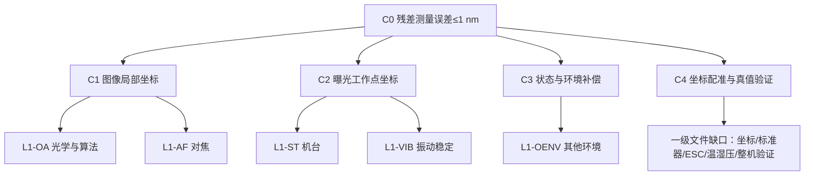

# 1 nm级图案位置/IPD量测证据树

> 版本：v0.3（一级证据重构版）
>
> 日期：2026-09-18
>
> 状态：内部论证基线，未形成样机验收结论
>
> 本版边界：只以“子系统.rar”内5份模块文件作为一级证据；此前整机项目书不作为本版依据

## 1. 本版首先纠正的两件事

### 1.1 “1 nm”约束的是残差值的测量能力，不是残差本身的大小

被测量是图案实测坐标与理论坐标经规定配准后的二维残差向量。真实残差可以小于、等于或大于1 nm；设备要证明的是对该残差的测量误差满足规定的1 nm能力，而不是要求被测残差天然小于1 nm。

设第 \(i\) 个图案的设计坐标为 \(\mathbf d_i\)，曝光时由干涉工作点坐标与图像像素定位共同形成的实测坐标为 \(\mathbf m_i\)，配准模型为 \(T(\cdot;\boldsymbol\beta)\)，则

\[
\hat{\boldsymbol\beta}
=\arg\min_{\boldsymbol\beta}\sum_i w_i
\left\|\mathbf m_i-T(\mathbf d_i;\boldsymbol\beta)\right\|^2,
\]

\[
\hat{\mathbf r}_i=\mathbf m_i-T(\mathbf d_i;\hat{\boldsymbol\beta}).
\]

真正受1 nm约束的是残差测量误差

\[
\boldsymbol\varepsilon_i=
\hat{\mathbf r}_i-\mathbf r_{i,\mathrm{true}},
\]

而不是 \(\hat{\mathbf r}_i\) 的数值大小。当前系统目标沿用技术基线定义：在规定条件下，补偿后二维综合残差测量误差满足

\[
3\sigma_{XY}=3\sqrt{\sigma_{x,\varepsilon}^2+\sigma_{y,\varepsilon}^2}\le1\ \mathrm{nm}.
\]

准确度还必须同时报告残余偏差、重复性、漂移、标定不确定度和覆盖因子；单独一个3σ不能替代完整准确度声明。

### 1.2 证据层级和误差预算层级是两套不同结构

- **证据层级**回答“哪个文件或试验支撑这项判断”。本版的一级证据只有“子系统.rar”内5份文件。
- **误差预算层级**回答“某个物理误差最终计入哪一项”。E1—E7是预算科目，不是一级证据。
- 同一份一级证据可同时支撑多个预算科目；同一预算科目也可能需要多份一级证据联合闭合。

## 2. 顶层主张与量测链

### 2.1 顶层主张 C0

在规定图案、照明、焦位、装夹、环境、测量路径、曝光窗口、标定版本和算法版本下，设备能够测得单die内各图案相对理论坐标的二维残差，并使该残差测量误差满足 \(3\sigma_{XY}\le1\ \mathrm{nm}\)。

### 2.2 从曝光到残差的完整链

每次曝光记录干涉仪工作点坐标 \(\bar{\mathbf s}_i\)；图像算法给出像素坐标 \(\mathbf u_i\)。经固定版本的局部映射 \(C\) 和全局变换 \(G\) 后：

\[
\mathbf m_i=
G\left[\bar{\mathbf s}_i+C(\mathbf u_i-\mathbf u_0)+\mathbf c_i\right],
\]

其中 \(\mathbf c_i\) 包含已经标定且有版本控制的畸变、镜面、几何、热和状态修正。然后以die内全部有效图案点求四参数相似变换或六参数仿射变换，并输出：

1. 变换参数及其协方差；
2. 由参数重建的低阶位移场；
3. 每个图案的局部残差矢量；
4. 拟合后残差统计、空间相关性和异常点记录。

四参数或六参数会吸收平移、旋转、尺度、正交性或剪切等低阶分量，但这些信息并未消失，必须由矩阵参数及其重建位移场一并输出，不能只保留局部残差图。

单die图案点数量足够多时，不要求永久划分固定“拟合点/测试点”。统计时应使用自由度 \(N-p\)（四参数 \(p=4\)，六参数 \(p=6\)），并通过重复采集、位置/方向变换、标准样件真值比较和必要的重采样诊断，防止同一数据拟合造成的残差低估。

## 3. 一级证据清单与身份

| 编号 | 一级证据文件 | 文档状态 | 直接覆盖范围 | 不直接证明 |
|---|---|---|---|---|
| L1-OA | 《1nm图形中心定位方案_光学与算法》 | 2026-09-03，最终版 | 194 nm成像、采样、光子噪声、边缘/中心估计、像差与照明、光学算法预算 | 全行程坐标、ESC、真实工作点运动、整机1 nm准确度 |
| L1-AF | 《对焦方案260911》 | 2026-09-11 | 斜狭缝AF、Z标定、捕获范围、切换重复性、单点时序 | Z误差折算到XY后的0.15 nm残差、150 ms完整周期 |
| L1-ST | 《机台子系统技术方案》 | V3.0，2026-09-10 | 400 mm宏微平台、四通道干涉、曝光坐标记录、工作点稳定、节拍与验证 | 图像定位、ESC补偿、完整坐标真值和整机准确度 |
| L1-VIB | 《振动隔离与运动稳定控制子系统方案》 | V1.1，2026-09-13 | 两级隔振、反力前馈、终端闭环、10 ms窗口指标与验证 | 与机台V3.0冲突项的裁决、完整图案坐标残差 |
| L1-OENV | 《其他环境因素控制子系统方案》 | V1.1，2026-09-13 | 洁净、AMC、EMI、电源、气流、声学与环境接口 | 温度/气压/湿度完整方案、热补偿残差 |

文件指纹及逐份摘要见[一级证据源清单与主张摘录](一级证据源清单与主张摘录.md)。

## 4. 一级证据树

一级证据的下级节点统一采用以下结构：

> 设计主张 → 作用机理/公式 → 关键假设 → 数值分配 → 下级原始依据 → 本项目试验 → 可交付记录 → 剩余缺口

一级文件中的设计目标、计算算例和待验证值只证明“方案提出了什么”，不自动升级为样机已有能力。

## 5. 一级证据逐支展开

### 5.1 L1-OA 光学与算法

**直接主张**

- 194 nm、NA约0.9、物方采样不大于25 nm时，理想高对比规则图形的光子噪声定位下限可进入0.03—0.1 nm量级。
- 文档给出的光学与算法合成预算约0.70 nm，原文口径为1σ目标体系，不得直接视作当前二维3σ预算。
- 像差校准后残差、照明非对称、像素内插值和真实边缘粗糙度是主要非理想项。

**关键计算节点**

\[
a_0=p/M,
\qquad
W_{10-90}\approx0.35\lambda/NA,
\]

\[
\sigma_r\approx1.88\frac{\sqrt{\sigma_ba}}{SNR},
\qquad
\sigma_c\approx\sigma_r\sqrt{\frac{2}{N}}.
\]

**必须下钻的证据**

- 公式来源、噪声模型和独立样本假设；
- 实际相机满阱、读出噪声、量子效率、曝光量与SNR；
- 真实图案而非理想圆/方形的中心定义；
- 194 nm全FOV的PSF、畸变、照明对称性和长期重复性；
- 已知二维坐标标准样件上的端到端残差。

**当前不能直接接受的数值跳跃**

- 原文称0.01—0.02 pixel插值误差在25 nm采样时“小于0.3 nm”，但直接乘法给出0.25—0.50 nm；上限不闭合。
- “平场后照明不对称小于0.1%”“像差校准效率超过99%”均为待验证设计条件。
- 0.70 nm的1σ合成不能直接支撑当前E1 0.55 nm与E3 0.35 nm的二维3σ分配。

### 5.2 L1-AF 自动对焦

**直接主张**

- 斜狭缝法采用 \(\Delta z=k(u_c-u_0)\)，理论几何灵敏度约6.14 nm/pixel；实际以干涉标定斜率 \(k\) 为准。
- 捕获范围按±1.2 µm工作；锁定后 \(|\Delta z|\le15\ \mathrm{nm}\)，最多3次迭代。
- 原文给出同点30次对焦1σ≤8 nm、3σ≤20 nm及切换重复性3σ≤8 nm。

**必须下钻的证据**

- Z基准及其溯源：文中“干涉标定”必须明确使用何种Z计量，不可与四路XY干涉混称；
- 不同材料层、反射率、图案密度和FOV位置的 \(k,u_0\)；
- AF态/成像态切换后焦位与横向像移；
- 本光学系统实测 \(K_{xz}=\partial x/\partial z\)、\(K_{yz}=\partial y/\partial z\)，再将Z残差传播到XY；
- AF失败、超时、重测和图像禁用记录。

**当前不能直接接受的数值跳跃**

- 1σ≤8 nm与3σ≤20 nm不满足严格的3倍关系，需统一统计定义。
- 单点AF循环约0.4—2.5 s，与机台150 ms完整周期存在数量级冲突。
- 原文只证明Z向性能目标，尚不能证明E7的0.15 nm二维XY残差。

### 5.3 L1-ST 机台、运动与工作点计量

**直接主张**

- 采用400 mm平面电机气浮宏动、XY音圈气浮微动、两X两Y双频干涉终端计量；每次曝光记录真实曝光窗口及同步位移。
- 图案坐标由曝光工作点坐标和图像局部坐标融合，名义指令位置不等于测量坐标。
- 工作点jitter、曝光内运动、曝光平均坐标、回位散布和最终IPD重复性是不同统计对象。
- 机台V3.0明确：全部指标是研发目标，尚无样机实测结果。

**关键模型**

\[
\mathbf p_i=\bar{\mathbf s}_i+A(\mathbf u_i-\mathbf u_0)+\mathbf c_i.
\]

\[
\sigma_{\mathrm{out}}^2=J\Sigma J^T,
\]

且存在相关项时必须保留交叉谱或协方差，不能把同源扰动重复RSS。

**关键验证节点**

- 额定负载、不少于9个代表位置、各方向不少于30次；
- 每通道不少于10 kSa/s、1 kHz抗混叠基线，120 s保持记录与真实曝光窗口同时评价；
- 独立环外计量覆盖晶圆—物镜工作点，而非只读取环内传感器；
- 暴露门、干涉采样、图像帧和算法坐标统一时基；
- 全行程镜面、阿贝、姿态、空气光程、结构差模及Z—XY耦合分别标定。

**当前风险**

- 宏动0.5 nm、微动0.8 nm、结构参考0.3 nm的RMS算例RSS约0.990 nm，几乎没有测量噪声和模型误差余量。
- 1 nm RMS工作点稳定不自动证明1 nm二维3σ的残差测量准确度。
- 150 ms在V3.0中是小步进完整周期的条件性预算，不是“停稳时间”。

### 5.4 L1-VIB 振动隔离与运动稳定

**直接主张**

- 两级主动隔振、反力前馈、宏微协同和终端干涉外环共同控制曝光窗口运动。
- 原文给出10 ms窗口内0.15 nm RMS/轴、0.8 nm峰峰值、0.5 nm回位3σ、150 ms稳定时间等目标。
- 原文提供隔振相关运动的频域积分、残余速度和衰减包络计算。

**必须下钻的证据**

- 地面输入PSD、隔振器实装传递矩阵和自噪声；
- 花岗岩—晶圆与花岗岩—计量框两支路的差分FRF；
- 控制器延迟、带宽、相位裕度、执行器饱和与前馈开/关对比；
- 10 ms真实曝光门下的环外工作点记录；
- 声学、气流和管线旁路对结构的输入。

**一级文件冲突**

该文件引用机台V2.1，并沿用旧的0.15 nm RMS、0.5 nm回位和150 ms稳定时间；机台V3.0已经明确这些值不再直接作为当前阶段准入判据。两份文件均为一级证据，因此本树不自行选择其一，统一列入版本裁决项CFL-01。

### 5.5 L1-OENV 其他环境因素

**直接主张**

- 覆盖洁净、AMC、晶圆表面保护、EMI/磁场、电源、气流、声学、ESD、地基沉降和杂散光。
- 气流折射率耦合给出0.05 nm RMS工程分配，洁净/AMC等多数属于完好性和可用性要求，不直接进入位置误差RSS。
- 温度、气压、湿度明确由另一分册承担，本文件不提供完整温湿压证据。

**关键验证节点**

- 气流必须测光路局部谱和折射率等效位移，不能只验平均风速；
- EMI须在驱动、隔振器和功率负载运行状态下比较干涉/电容读数；
- 声学需通过结构路径传递到工作点残差；
- 环境记录必须与曝光时间戳关联；
- 洁净、AMC、氧化、UPS、ESD和杂散光分别按相应完整性指标验收，不与1 nm位置误差重复合成。

**当前不能直接接受的数值跳跃**

- 文件仍引用机台V2.1和“≤150 ms稳定”，与机台V3.0冲突。
- 0.05 nm气流项是工程分配，尚无光路局部实测谱支撑。
- “45±2%RH下测量段氧化远低于0.1 nm”等结论需原始试验或材料文献回查。

## 6. 一级证据到E1—E7预算科目的映射

表中“主”表示直接证据，“辅”表示接口或间接证据，“缺”表示现有5份一级文件不能闭合。

| 预算科目 | 当前二维3σ工程分配 | L1-OA | L1-AF | L1-ST | L1-VIB | L1-OENV | 闭合判断 |
|---|---:|---|---|---|---|---|---|
| E1 图像与中心定位 | 0.55 nm | 主 | 辅 | 辅 | — | 辅 | 有原理与算例，无真实图案/标准器端到端证据 |
| E2 运动与位置计量 | 0.55 nm | 辅 | 辅 | 主 | 主 | 辅 | 有完整架构与试验设计，一级文件指标冲突，尚无样机数据 |
| E3 光学映射补偿 | 0.35 nm | 主 | 辅 | 辅 | — | 辅 | 有校准思路，无二维可溯源标准器和全FOV实测残差 |
| E4 ESC/装夹/面形 | 0.35 nm | — | — | 辅 | 辅 | 辅 | 缺一级ESC文件；现有ESC材料只能作为下级证据 |
| E5 温度与慢环境 | 0.25 nm | 辅 | 辅 | 辅 | 辅 | 仅接口 | 缺温度/气压/湿度一级文件与热补偿实测 |
| E6 全局坐标标定 | 0.25 nm | 辅 | — | 辅 | 辅 | — | 缺坐标/标准器一级文件；用户已确认流程，但尚缺书面方案和不确定度 |
| E7 Z/AF及XY耦合 | 0.15 nm | 辅 | 主 | 主 | 辅 | — | Z方案存在，Z→XY传播未闭合 |

以上预算仅是系统V0.1目标分配。一级证据中的1σ、单轴RMS、峰峰值、回位3σ和二维3σ不得直接互换；所有换算必须保留统计对象、频带、窗口、样本量和相关性。

## 7. 当前缺失的一级证据

### G1 坐标融合、die内矩阵匹配与标准器

需要形成独立一级文件，至少冻结：

- 机械/干涉坐标与像素坐标的字段、方向、单位、曝光权重和时间戳；
- 四参数与六参数的启用条件、权重、鲁棒规则和自由度；
- 矩阵参数、低阶位移场和局部残差的共同输出；
- 已知二维坐标偏差标准样件的真值、不确定度和溯源链；
- 补偿前、补偿后、重复性、偏差、漂移和扩展不确定度报告格式。

### G2 ESC、装夹与面形补偿

压缩包中无ESC一级文件。必须补充夹持状态、面形基准、Z形貌到XY的传递、重复装夹、温控/吸附参数、Map更新条件及补偿后残差。

### G3 温度、气压与湿度

两份环境文件都引用《设备内温度、气压与湿度控制子系统方案V3.0》，但该文件不在本次一级证据包中。必须补充局部温度场、有效热灵敏度、空气折射率、补偿模型、标定周期和长时残差。

### G4 系统标定与整机验收

缺少独立一级文件规定：标准器、真值、环外参考、测量程序、样本量、最差工况、异常值、判定保护带、协方差和最终不确定度。没有该文件，即使各模块目标都成立，也不能形成C0的验收证据。

### G5 图案对象与理论坐标数据契约

必须固定图案ID、die/wafer坐标、理论坐标版本、层别、图案中心定义、缺陷标记、不可用点规则及设计数据变更追溯，否则残差对象本身不稳定。

## 8. 一级证据冲突台账

| 编号 | 冲突/不一致 | 涉及文件 | 影响 | 处理要求 |
|---|---|---|---|---|
| CFL-01 | 0.15 nm RMS、0.5 nm回位、150 ms稳定仍被采用；机台V3.0已降为旧值或待评估值 | L1-VIB/L1-OENV vs L1-ST | E2指标和节拍不可验收 | 由系统评审冻结唯一版本并同步回写两份环境文件 |
| CFL-02 | 150 ms含义不同：稳定时间 vs 小步进完整周期 | L1-VIB/L1-OENV vs L1-ST | 节拍差一个动作链 | 统一为状态机逐段时间并给出可并行关系 |
| CFL-03 | AF单点0.4—2.5 s vs 150 ms完整周期 | L1-AF vs L1-ST | 当前AF策略无法支持逐FOV 150 ms | 冻结预调焦/抽样AF/预测AF策略或修改节拍 |
| CFL-04 | 光学算法0.70 nm按原文1σ体系 vs 当前E1+E3二维3σ分配 | L1-OA vs 系统预算 | 数值无法直接比较 | 用统一标准样件和坐标链重新分配、重新换算 |
| CFL-05 | 机台文件前段提到X、Y各3σ≤1 nm，当前系统基线为二维综合3σ≤1 nm | L1-ST vs 技术基线 | 验收口径不同 | 一级文件修订为同一二维口径，保留单轴报告 |
| CFL-06 | AF重复性1σ≤8 nm、3σ≤20 nm | L1-AF | 统计定义不一致 | 明确是样本标准差、包络还是保护带后重算 |
| CFL-07 | 光学插值误差25 nm采样时为0.25—0.50 nm，却写“小于0.3 nm” | L1-OA | E1预算乐观 | 以实测像素相位扫描和算法误差分布冻结上限 |
| CFL-08 | 环境文件引用缺失的温湿压V3.0作为关键输入 | L1-VIB/L1-OENV | E5无法审计 | 将该文件补入一级证据包或降级相关主张 |

## 9. 证据成熟度判定

| 等级 | 含义 | 本版使用规则 |
|---|---|---|
| M0 | 只有需求或目标 | 不能证明可行性 |
| M1 | 有机理与数量级计算 | 可支持方案方向，不支持指标达成 |
| M2 | 有下级公开证据/部件规格并完成本机条件换算 | 可支持设计可行性，仍不等于本机能力 |
| M3 | 有本项目子系统试验、原始数据和不确定度 | 可支持对应子系统指标 |
| M4 | 有标准样件端到端、跨工况、环外验证 | 可支持系统级残差测量能力 |
| M5 | 有冻结流程的整机验收和复现 | 可形成对外性能结论 |

当前判断：L1-OA、L1-AF、L1-ST、L1-VIB和L1-OENV主要处于M1，少数公开路线可到M2；尚无M3—M5证据。C0因此处于“设计论证中”，不能写成已达到1 nm。

验证任务、试验条件和数据交付物详见[系统证据闭环与验证矩阵](系统证据闭环与验证矩阵.md)；标准、论文、专利和供应商资料的回查入口见[下级证据索引](下级证据索引.md)。

## 10. 需要形成的证据包

每个关键主张最终应包含下列可审计对象：

1. 需求编号、量值、单位、统计口径、边界条件；
2. 原始误差源及到残差测量误差的传递方程；
3. 可观测量、传感器、标定方法和可溯源基准；
4. 原始数据、时间戳、环境与设备状态；
5. 补偿模型、参数版本、训练/标定数据和适用域；
6. 补偿前后结果、残余偏差、重复性、漂移和协方差；
7. 标准器不确定度、环外计量不确定度和判定保护带；
8. 最差位置、方向、图案、焦位、装夹、温度和时间跨度；
9. 失败帧、超时、重测、异常值及不可用点的完整记录；
10. 结论强度、尚未证明项、责任人和关闭条件。

## 11. 最短闭环路径

1. 先冻结CFL-01至CFL-08，尤其是二维3σ口径、150 ms含义和AF策略；
2. 补齐G1坐标/标准器、G2 ESC、G3温湿压和G4系统验收四份一级文件；
3. 用已知二维坐标偏差标准样件完成“曝光干涉坐标＋像素坐标→矩阵→残差”的端到端试验；
4. 对光学/算法、运动/计量、AF/XY耦合、ESC/热环境分别做受控误差注入，识别灵敏度矩阵与协方差；
5. 在全FOV、全行程、多方向、多状态下重复完整流程，形成补偿前/后残差与不确定度；
6. 最后再用冻结版本的完整配方证明 \(3\sigma_{XY}\le1\ \mathrm{nm}\)，并单独报告偏差与扩展不确定度。

## 12. 不进入本机1 nm主预算的对象

- 25个实测die到未测die的高阶场预测误差；
- die内稀疏采样替代全部图案的重建误差；
- Pre/Post两次量测的跨时间、跨装夹和跨工艺差分误差；
- IPD到Bonding Overlay、空洞、黏附或结合强度的推断误差；
- IPD到CPE参数和曝光后Overlay改善量的模型误差。

这些属于应用或扩展验证，不能替代残差值本身的1 nm量测能力证明。
